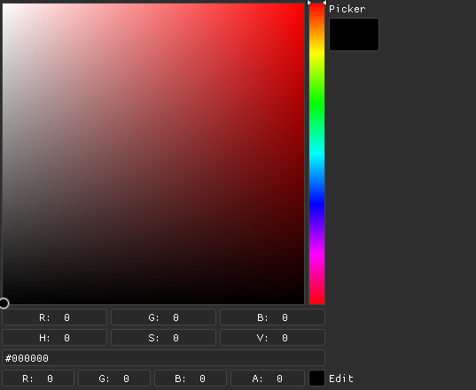

# pf_imgui
[](https://app.codacy.com/gh/PetrFlajsingr/pf_imgui?utm_source=github.com&utm_medium=referral&utm_content=PetrFlajsingr/pf_imgui&utm_campaign=Badge_Grade_Settings)
[](https://travis-ci.org/PetrFlajsingr/pf_imgui)
[](https://github.com/PetrFlajsingr/pf_imgui/releases)
[](https://github.com/PetrFlajsingr/pf_imgui/actions)
[](https://github.com/PetrFlajsingr/pf_imgui/actions)
[](https://github.com/PetrFlajsingr/pf_imgui/actions)


[Documentation](https://petrflajsingr.github.io/pf_imgui/)

This library is a wrapper of [DearImGui](https://github.com/ocornut/imgui). It currently has too many dependencies, which are downloaded via [CPM](https://github.com/cpm-cmake/CPM.cmake), but I'm planning on getting rid of some of them.

# Examples
In these examples `imgui` is an instance of `std::unique_ptr<ImGuiInterface>`. Examples only show basic usage, the classes usually have more functionality.

### ImGuiInterface
`ImGuiInterface` needs to be subclassed with a custom rendering backend. It must also provide functionality to update font atlas when requested.

There are some backend implementations in `pf_imgui/backends`. If you wish to use those you gotta add them to the project yourself, they are not part of the library by default.

## Common interfaces
All of the functions which register an observer return an instance of `Subscription` which can be used to cancel the observer.
### Drag and drop
Many elements provide drag and drop capabilities. For now, elements can only accept a payload of the same type as the source.
```cpp
auto &sliderSource = imgui->createChild<Slider<float>>(...);
auto &sliderTarget = imgui->createChild<Slider<float>>(...);
sliderSource.setDragAllowed(true);
sliderSource.setDragTooltip("Value: {}"); // if the stored value type is pf::ToStringConvertible, the {} will be replaced with its string representation
sliderTarget.setDropAllowed(true);
```

### Fonts
Only the default font is created upon `ImGuiInterface` creation. You can call its constructor with `IconPack` enum to add support for icons. These are used as follows:
```cpp
// imgui created with IconPack::ForkAwesome
window.createChild<Text>("text_id", ICON_FK_FILE_O " Open file");
```

New fonts can be loaded via `FontManager`:
```cpp
auto fontBuilder = imgui->getFontManager().fontBuilder("font name", "path/to/ttf/file");
auto newFont = fontBuilder
                  .setFontSize(16)
                  .addSubfont("path/to/ttf/file") // this allows you to add custom fonts which will be baked inside the master one
                    .setGlyphRange({0xFFFF, 0xFFFF}) // range which will get replaced in the master font
                  .endSubfont();
                  .build();
```

If a font is set to an element it'll be used in its children as well, unless you explicitly set a different font for them.

```cpp
auto font = imgui->getFontManager().fontByName("arial11");
if (font.has_value()) {
  myTextElement.setFont(*font);
}
```

### Clickable
An element which is derived from clickable allows you to add an observer to its click event.
```cpp
auto &button = window.createChild<Button>("button_id", "Click me");
auto subscription = button.addClickListener([] {
  print("button clicked");
});
// ...
if (something) {
  subscription.unsubscribe(); // cancel the observer
}
```

### Collapsible
Elements derived from this interface allow itself to be collapsed. You can also observe this event.
```cpp
auto &window = imgui->createWindow("window_id", "Window name");
// enables a button to collapse the window, clicking the button makes it collapse and the following callback is called
window.setCollapsible(true); 
window.addCollapseListener([](bool collapsed) { 
  print("Window collapsed: {}", collapsed); 
});
// ...
window.setCollapsed(true);
```

### Customizable
This interface allows its derived classes to apply certain style/color changes. You can see which styles/colors can be modified in the base class list of the element you are to use.
```cpp
auto &button = window.createChild<Button>("button_id", "Click me");
button.setColor<styles::ColorOf::Button>(ImVec4{1, 0, 0, 1});
button.setColor<styles::ColorOf::ButtonHovered>(ImVec4{0, 1, 0, 1});
```

### ItemElement
ItemElement is an element which can receive focus and hover events. It can also have a tooltip and popup menu.
```cpp
auto &button = window.createChild<Button>("button_id", "Click me");
button.setTooltip("This is a button"); // create a simple text tooltip
button.createTooltip().createChild<Image>(...); // create a tooltip with an image
auto &buttonPopupMenu = button.createPopupMenu();
buttonPopupMenu.addButonItem("item1", "Remove");
buttonPopupMenu.addButonItem("item2", "Duplicate");
buttonPopupMenu.addCheckboxItem("item3", "Enabled");

button.addFocusListener([] (bool isFocused) {});
button.addHoverListener([] (bool isHovered) {});
```

### Labellable
An element which provides some sort of label.
```cpp
auto &button = window.createChild<Button>("button_id", "THIS IS A LABEL");
button.setLabel("NEW LABEL");
```

### Positionable
Elements deriving from this interface provide an observable interface for their position. You can also change their position programmatically.
```cpp
auto &window = imgui->createWindow("window_id", "Window name");
window.addPositionListener([](ImVec2 newPosition));
window.setPosition(ImVec2{100, 100});
```

### Resizable
These elements can have both their width and height controlled. Not many elements can actually provide this capability.
```cpp
auto &window = imgui->createWindow("window_id", "Window name");
window.addSizeListener([] (Size newSize) {});
window.setSize(Size{Width::Auto(), 100});
```

### Savable
Elements derived from this interface can be serialized to `toml` (and deserialized from it as well). This is used to save their state to a config file.
```cpp
auto &checkbox = imgui->createChild<Checkbox>("id", "Checkbox", Checkbox::Type::Toggle, false, Persistent::Yes);
```

### ValueObservable
This interface is being derived from in each element, which holds an inner value.
```cpp
auto &checkbox = imgui->createChild<Checkbox>("id", "Checkbox");
checkbox.addValueListener([](bool isChecked){});
// ...
checkbox.setValue(false);
```

## Decorators
### WidthDecorator
This decorator can be applied to elements derived from `ItemElement` to control their width.
```cpp
auto &inputText = imgui->createChild<WidthDecorator<InputText>>("id", Width::Auto(), "Text");
inputText.setWidth(100);
```

## Dialogs
### Window
```cpp
auto &window = imgui->createWindow("window_id", "Window name");
// enables a button to close the window, clicking the button makes the window invisible and the following callback is called
window.setCloseable(true); 
window.addCloseListener([] { 
  print("Window closed"); 
});
// enables a button to collapse the window, clicking the button makes it collapse and the following callback is called
window.setCollapsible(true); 
window.addCollapseListener([](bool collapsed) { 
  print("Window collapsed: {}", collapsed); 
});
// sets size of the window and calls any listeners
window.setSize(Size{100, 50}); 
// called when setSize is used or size is changed by the user
window.addSizeListener([](Size newSize) { 
  print("Window size: {}x{}", newSize.width, newSize.height); 
}); 

// delimit range of allowed window size
window.setMinSizeConstraints(Size{10, 10});
window.setMaxSizeConstraints(Size{100, 100});

// create an element inside the window
window.createChild<Button>("button_id", "Button label"); 

// create or get a MenuBar for the window
auto &menuBar = window.getMenuBar(); 
```


### ModalDialog
A dialog which blocks user from interacting with anything else.
```cpp
auto &dialog = imgui->createDialog("dialog_id", "Title");

dialog.createChild<Button>("dialog_close_button", "Close")
    .addClickListener([&dialog] {
      dialog.close();
    });
// ... add more elements into the dialog

```


There are some additional `ModalDialog` descendants for easy of usage:

* `InputDialog` for string input.
```cpp
auto handleInput = [](std::string input) { 
  print(input);
};
auto handleClose = [] { 
  print("closed"); 
};
auto &inputDialog = imgui->openInputDialog("Title", 
                                           "message to user", 
                                           handleInput, 
                                           handleClose);
```

* `MessageDialog` to show a message and get user response.
```cpp
// get the button user clicked and return true if you want to close the dialog
auto handleInput = [](ButtonTypes input) { 
  if (input == ButtonTypes::Ok) { return true; } 
}; 
using namespace pf::enum_operators;
auto &inputDialog = imgui->createMsgDlg("Title", 
                                        "message to user", 
                                        ButtonTypes::Ok | ButtonTypes::Cancel, 
                                        handleInput);
```


### FileDialog - uses [ImGuiFileDialog](https://github.com/aiekick/ImGuiFileDialog)
Allows the user to select directories or files with a filter.
```cpp
const auto allowedExtensions = {"vox", "pf_vox"};
const auto filetypeDescription = "Vox model";
const auto filetypeColor = ImVec4{1, 0, 0, 1};
const auto extensionSettings = FileExtensionSettings{allowedExtensions, 
                                                     filetypeDescription, 
                                                     filetypeColor};
// there can be multiple of these settings
const auto onFilesSelected = [](std::vector<std::filesystem::path> selection) {
  std::ranges::for_each(selection, printPath);
};
const auto onSelectionCanceled = [] { print("Canceled selection"); };
const auto startPath = "/home/pf_imgui"; // path at which the dialog will open
imgui->openFileDialog("Title", 
                      {extensionSettings}, 
                      onFilesSelected, 
                      onSelectionCanceled, 
                      Size{500, 400}, 
                      startPath);
```


## Elements
### Button
```cpp
auto &button = window.createChild<Button>("button_id", "Click me");
button.addClickListener([] {
  print("button clicked");
});
```


### Bullet
A CRTP decorator which adds a bullet to the left of the inner element.
```cpp
auto &button = window.createChild<Bullet<Button>>("button_id", "Click me");
```


### Checkbox
```cpp
auto &checkbox = window.createChild<Checkbox>("checkbox_id", "Check me", false);
checkbox.addValueListener([](bool selected) {
  print("Selected: {}", selected);
});
```


### ColorChooser
For selection of colors. It supports 3 or 4 component colors and there are two types available:
* `ColorChooserType::Edit` - slider for each component
* `ColorChooserType::Picker` - slider for each component and a paletter

  

TODO:
### CustomCombobox
### Combobox
### CustomListbox
### Listbox
### DragInput
### FlameGraph
### Group
### Image
### Input
### InputText
### MarkdownText
### Memo
### MemoryEditor
### Menus
#### details
### ProgressBar
### RadioButton/group
### Range2D
### Selectable
### Separator
### Slider
### Slider2D
### Slider3D
### SliderAngle
### VerticalSlider
### SpinInput
### TabBar
### Table
### StringTable
### Text
### Tooltip
### Tree


## Plots


## Layouts
### AbsoluteLayout
### AnchorLayout
### BoxLayout
### GridLayout
### StackedLayout
### StretchLayout
